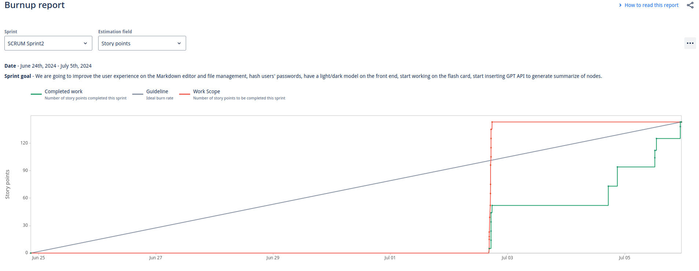

# Sprint Burndown Report

## Sprint Details
- **Sprint:** SCRUM Sprint2
- **Date:** June 24th, 2024 - July 5th, 2024
- **Sprint Goal:** Improve the user experience on the Markdown editor and file management, hash users' passwords, implement a light/dark mode on the front end, start working on the flashcard feature, and integrate the ChatGPT API to generate summaries of notes.

## Burndown Chart

## Comments on the Burndown Chart
The burndown chart indicates the progress of the sprint in terms of story points completed over time. Here are some observations:

1. **Initial Work Scope:** The red line represents the initial work scope, which remained constant until July 1st.
2. **Completed Work:** The green line shows the number of story points completed. There was a significant increase in completed work towards the end of the sprint, indicating a late push to finish tasks.
3. **Guideline:** The blue line represents the ideal burn rate. The actual completion rate lagged behind the guideline initially but caught up towards the end.

## Velocity Comparison
- **Planned Velocity for this Sprint:** 130 story points
- **Previous Sprint Velocity:** 110 story points

### Velocity Analysis
The velocity increased from 110 story points in the previous sprint to 130 story points in the current sprint. This change can be attributed to several factors:
- **Improved Team Efficiency:** The team might have become more familiar with the project and improved their efficiency.
- **Better Task Estimation:** More accurate estimation of story points could have led to better planning and execution.
- **Increased Effort:** The team might have put in extra effort towards the end of the sprint to meet the sprint goal.

### Conclusion
The burndown chart reflects a successful sprint where the team managed to complete the planned work despite a slow start. The increase in velocity indicates a positive trend in team performance, which can be attributed to improved efficiency, better estimation, and increased effort.

