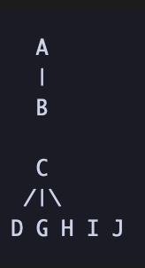

# Schedule

## Introduction
This document outlines the tasks, dependencies, and critical path for our sprint. It also discusses strategies to keep the sprint on schedule and analyzes any issues encountered.

## Tasks and Dependencies
1. Task A: Optimize login interface
2. Task B: Encrypt passwords for login users
3. Task C: Redesign homepage Markdown editor interface (adapt to Node 22 version)
4. Task D: Ensure compatibility of Markdown editor interface with other interactive components
5. Task E: Implement dark mode for the interface
6. Task F: Implement file browsing functionality in the profile interface
7. Task G: Fix issue of Markdown editor losing information when navigating between pages
8. Task H: Implement local search functionality for notes
9. Task I: Implement ChatGPT API to automatically generate notes
10. Task J: Implement flashcard generation functionality

Dependencies:
- Task B depends on Task A.
- Task D depends on Task C.
- Task G depends on Task C.
- Task H depends on Task C.
- Task I depends on Task C.
- Task J depends on Task C.
- Task E, Task F, Task H, Task I, and Task J are independent tasks.

## Network Diagram

## Critical Path Identification
The critical paths are C -> D, C -> G, C -> H, C -> I, C -> J.

## Keeping the Sprint on Schedule
- Regular monitoring and adjustments
- Daily stand-up meetings
- Project management tools
- Clear communication
- Prioritizing critical path tasks

## Issues and Learnings
If the sprint was delayed, identify the cause using the network diagram. Learn from the experience to improve future sprints.
