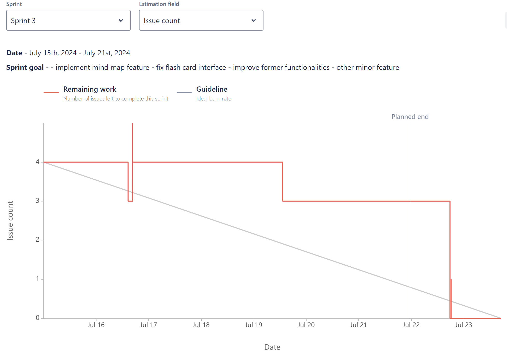

# Sprint Burndown Report
## Sprint Details
- **Sprint:** SCRUM Sprint 2
- **Date**: Jult 8th, 2024 - July 19th, 2024
- **Sprint Goal** : Build comprehensive flash card feature, including creating, deleting, and generating flash card based on written notes, build global search notes feature and comment feature, starting working on the mind-map feature, create mind-map interface and corresponding back end for functionality as creating, and deleting.
## Burndown Chart

## Comments on the Burndown Chart
The burndown chart indicates the progress of the sprint in terms of Issue count completed over time. Here are some observations:
1. **Initial Phase (July 8th - July 16th):**  Our team maintained a steady pace and effectively identified new issues, ensuring all necessary work was accounted for early in the sprint.
2. **Mid-Sprint Phase (July 17th - July 20th):**  Significant progress was made, demonstrating the team's ability to resolve issues efficiently and work towards the sprint goal.
3. **Final Phase (July 20st - July 21rd):**  Our team showcased remarkable productivity by completing almost all issues ahead of the planned end date.
## Velocity Sprint 3 
- The burndown chart for Sprint 3 showed fluctuations due to the addition of new issues mid-sprint.
- The team managed to complete all issues by the end of the sprint, maintaining effective velocity.
## Comparison of Velocity
- **Sprint 2:** The velocity remained steady with a planned work scope of approximately 130 story points. The team adapted well to the increase in scope and maintained a consistent completion rate.
- **Sprint 3:** The velocity experienced fluctuations due to scope changes but ultimately matched the ideal burn rate towards the end of the sprint.
## Why Velocity changes
For this sprint, we primarily focused on integrating the Mind Map API and fixing small existing bugs, which presented significant challenges. Overcoming these challenges required substantial time and effort, as we conducted numerous meetings to discuss issues and sought solutions through additional research and learning. Once the issues were resolved, our speed increased, resulting in a faster burn rate. This effort reflects our commitment to addressing complexities and ensuring the successful completion of sprint goals.