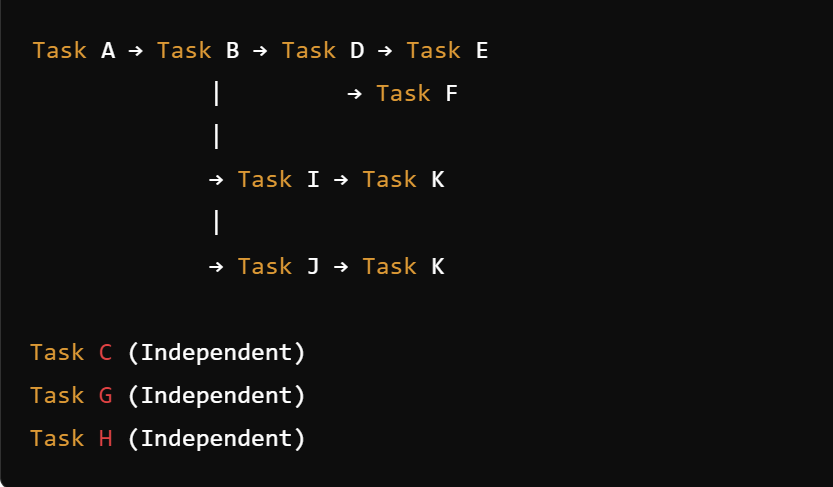

# Sprint Schedule Report

## Tasks and Dependencies
- **Task A:** Research and planning for Mind Map API integration
- **Task B:** Development of Mind Map API integration (depends on Task A)
- **Task C:** Fixing small existing bugs (independent)
- **Task D:** Creating flashcard feature (depends on Task B)
- **Task E:** Deleting flashcard feature (depends on Task D)
- **Task F:** Generating flashcards based on written notes (depends on Task D)
- **Task G:** Global search notes feature (independent)
- **Task H:** Comment feature (independent)
- **Task I:** Mind-map interface development (depends on Task B)
- **Task J:** Mind-map backend development (depends on Task B)
- **Task K:** Creating and deleting functionality for mind-map (depends on Task I and Task J)
 
## Network Diagram

## Critical Path
The critical path is **A → B → I → K**. This path determines the minimum duration to complete the sprint.

## Steps to Keep Sprint on Schedule
- Conducted regular stand-up meetings to monitor progress and address any blockers immediately.
- Ensured clear and effective communication among team members, especially regarding dependencies.
- Utilized Jira to track the progress of tasks and dependencies, ensuring visibility of the critical path.
- Allocated additional resources to critical tasks when necessary to prevent delays.

## Analysis of Delays
If we were unable to finish the sprint on time:
- **Delays Identified:** Delays occurred primarily in Task B (Development of Mind Map API integration) due to unexpected technical challenges.
- **Factors Leading to Delays:** Lack of familiarity with the API, underestimation of the complexity of integration, and insufficient initial planning.
- **Lessons Learned:**
    - Allocate more time for research and planning when dealing with unfamiliar technologies.
    - Improve estimation accuracy by involving more team members in the estimation process.
    - Enhance team skills through training and knowledge sharing sessions.

## Conclusion
By analyzing the network diagram and identifying the critical path, we were able to manage our sprint more effectively. Despite facing challenges, our focused efforts on resolving blockers and maintaining communication helped us achieve our goals.

