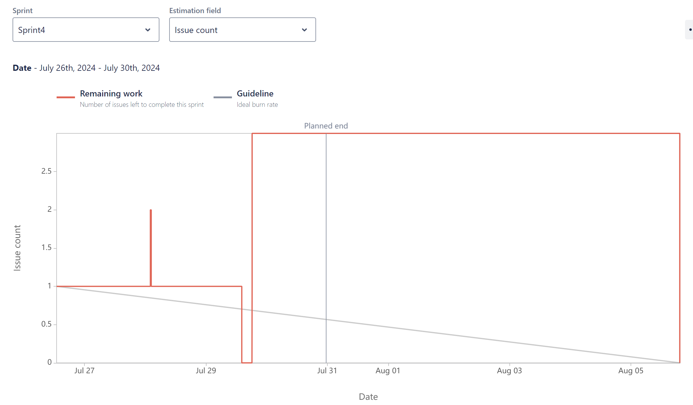
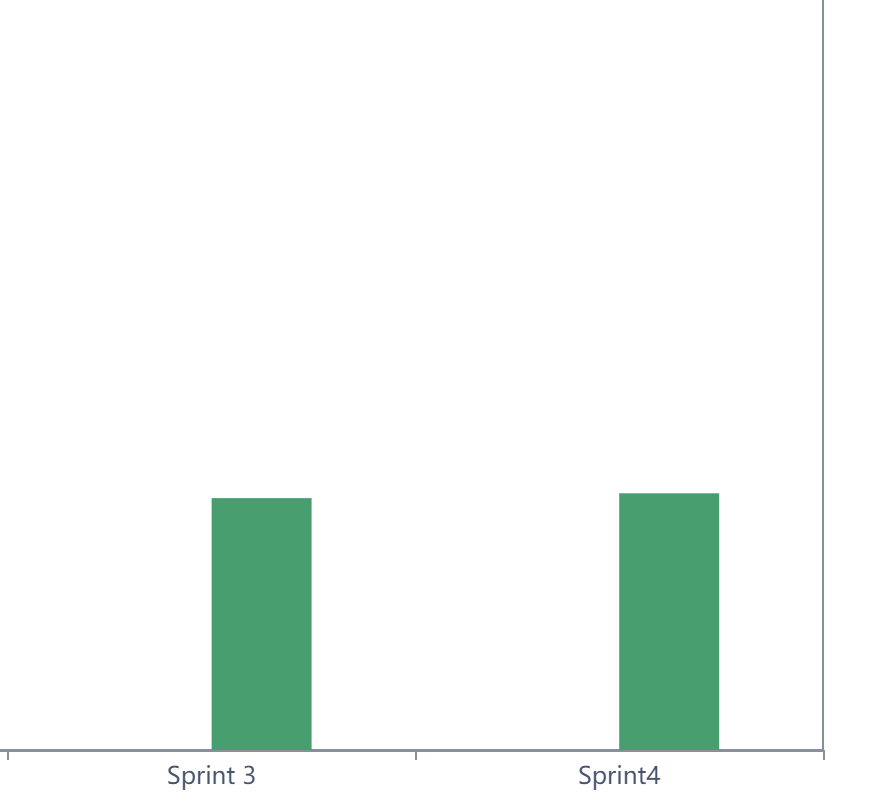

# Sprint Burndown Report
## Sprint Details
- **Sprint:** SCRUM Sprint 3
- **Date**: July 22th, 2024 - Aug 5th, 2024
- **Sprint Goal** : Complete the preview of MindMap, have a button to let user control publicity of notes
## Burndown Chart

## Comments on the Burndown Chart
The burndown chart indicates the progress of the sprint in terms of Issue count completed over time. Here are some observations:
1. **Initial Phase (July 26th):**  Our team maintained a steady pace and effectively identified new issues, ensuring all necessary work was accounted for early in the sprint.
2. **Mid-Sprint Phase (July 27th - July 30th):**  Significant progress was made, demonstrating the team's ability to resolve issues efficiently and work towards the sprint goal.
3. **Final Phase (July 30th):**  Our team showcased remarkable productivity by completing almost all issues ahead of the planned end date.
## Velocity Sprint 4
- The burndown chart for Sprint 4 showed in a box shape due to the high quality of completement of previous sprint, so we do not left too much on sprint 4 .
- The team managed to complete all issues by the end of the sprint, maintaining effective velocity.
- Despite an initial flat period, our team showcased exceptional effort and collaboration towards the end of the sprint, successfully completing all remaining issues by the planned end date. This strong finish reflects the team's determination and commitment to meeting their goals.
## Comparison of Velocity

- **Sprint 3:** The velocity remained steady. The team adapted well to the increase in scope and maintained a consistent completion rate.
- **Sprint 4:** The velocity highlights the team's capability to deliver high-quality work efficiently. By the image above, the velocity looks similar to the sprint 3.
## Why Velocity changes
For this sprint, we primarily focused on solving the preview and editing mind-map and fixing small existing bugs, which presented significant challenges. Overcoming these challenges required some time and effort, but we have completed most of the problems at previous sprints. This effort reflects our commitment to addressing complexities and ensuring the successful completion of sprint goals.